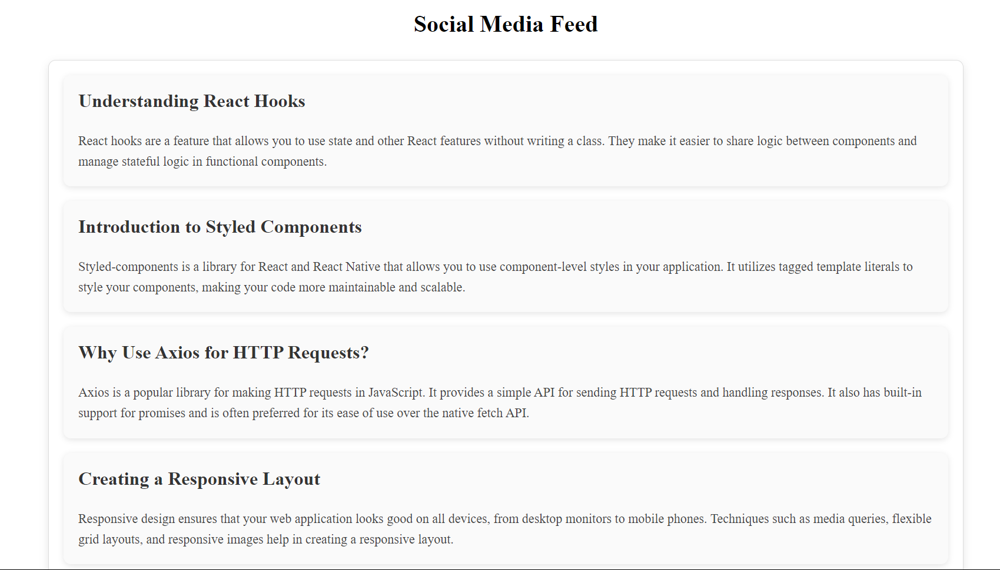

# Infinite Scrolling in React

## Overview

This project demonstrates how to implement infinite scrolling in a React component. Infinite scrolling allows users to continuously load new content as they scroll down, improving user experience by avoiding pagination and keeping users engaged.

## How to Implement Infinite Scrolling

To implement infinite scrolling in a React component, follow these steps:

1. **Set Up State and References:**
   * Use React state to manage posts, loading status, and the current page.
   * Use `useRef` to create a reference for the loader element to observe its visibility.
2. **Fetch Posts:**
   * Use `axios` or `fetch` to make API calls and retrieve posts. Update the state with new posts.
3. **Intersection Observer:**
   * Use the Intersection Observer API to detect when the loader element is visible in the viewport. Trigger a function to fetch new posts when it becomes visible.
4. **Handle Loading States:**
   * Show a spinner or loading indicator while new posts are being fetched to inform users that more content is loading.

## Fetch and Display Additional Posts

Here's a brief overview of the implementation:

* **Fetch Posts:**
  * Make an API call to fetch a page of posts when the user scrolls to the bottom.
  * Append new posts to the existing list of posts.
* **Display Posts:**
  * Map through the posts and render each one in the UI.
  * Ensure that each post has a unique key.

## Optimize Loading of Posts

To optimize performance and user experience:

* **Pagination:**
  * Implement server-side pagination to limit the amount of data fetched in each request.
* **Caching:**
  * Use caching strategies to avoid refetching already loaded data.
* **Lazy Loading:**
  * Load images and other resources lazily to reduce initial load time.
* **Debouncing:**
  * Debounce scroll events to prevent excessive API calls and improve performance.

## Handling Loading States

To handle loading states:

* **Show a Spinner:**
  * Display a spinner or loading indicator when fetching posts. Use CSS or a library like Bootstrap to style the spinner.
* **Update UI:**
  * Ensure that the UI remains responsive and that users are informed when new posts are being fetched.

## Potential Challenges and Solutions

1. **Performance Issues:**
   * **Challenge:** Loading a large number of posts can impact performance.
   * **Solution:** Implement pagination and lazy loading to reduce the amount of data rendered at once.
2. **API Rate Limits:**
   * **Challenge:** Frequent API calls can hit rate limits.
   * **Solution:** Implement caching and limit the frequency of API calls.
3. **Handling Errors:**
   * **Challenge:** Network errors can disrupt the user experience.
   * **Solution:** Implement error handling and provide feedback to users if an error occurs.
4. **User Experience:**
   * **Challenge:** Users might not notice new posts being loaded.
   * **Solution:** Use clear visual indicators and ensure the loading spinner is visible.

## Output Example

Here is a screenshot of the infinite scrolling feed in action:

